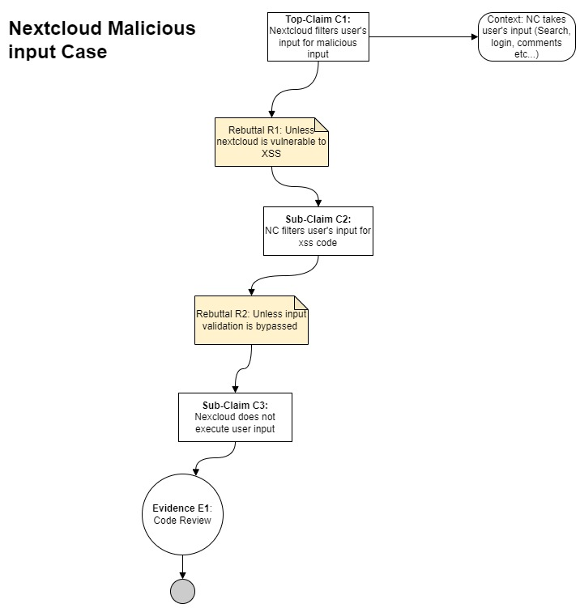

# CYBR/CSCI 8420, Fall 2023: Assignment 3 - Assurance Cases for SSE

Assignment Overview / Project Board
-
This document will review the development of four top-level assurance claims for our hypothetical bank application using the Nextcloud application.

Top-Level Claim #1
-
### Claim: Nextcloud minimizes malicious input execution
#### Description
User input is processed by nexcloud for searches, login, comments etc. This input can very well be used to perform many malicious activites such as extracting information from the database or executing complex script on the user's machine or even on the server. User's input represent a critical data that must be handled with care otherwise it could have some serious repercution for the business. 
The Assurance Case below seek to mitigate this risk. 

Top-Level Claim #2
-
### Claim: NextCloud eliminates unauthorized account access
#### Description

Top-Level Claim #3
-
### Claim

Top-Level Claim #4
-
### Claim
- The Nextcloud ...
