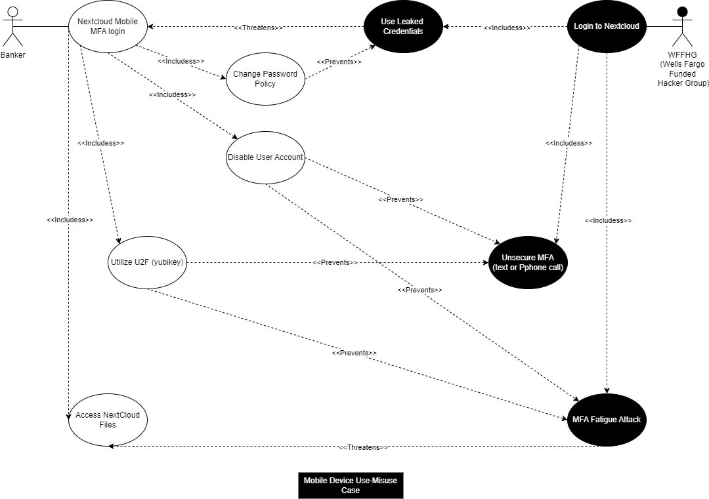

##Part 1 - Misuse Case Diagrams

### Misuse Case example 1 - File Access

#### Use Case  
Bank employees, customers, and even the partners that will be sending or receiving files from GFH Bank will all be targets of the hacker groups specifically Legion of Doom who will be attempting to gain access to files through login hacking attacks. When the employees, customers, and partners access files they will need to go through a login portal and use credentials to access this portal. Other measures not outlined in this use case such as MFA and one-time time based-passwords (TOTP) will be implemented alongside a strongly configured User Password Policy.

#### Misues Case  
The hacker group Legion of Doom is a threat to our Customer and Banker files that include PII (Personally Identifiable Information). With access to files compromised, they would be able to steal identities, create fake accounts, and much more with customer data. The misuse could incorporate many different forms of attacks such as Brute Force Attacks, Dictionary Attacks, and Credential Stuffing. These attacks have various forms of prevention built into the NextCloud Server User Password Policy and thus it should be fully implemented with all its feature capabilities to prevent these issues.

### Prevention of misuse case
To prevent the misuse of the access to files, NextCloud Server has a strong and multi-optioned Password Policy that can be found here. 
https://docs.nextcloud.com/server/latest/admin_manual/configuration_user/user_password_policy.html
A password policy is a set of rules designed to enhance computer security by encouraging users to employ strong passwords and use them properly.

In the security-section of your administrator-settings you can configure:
* A minimal length of a password. Default is 10 characters.
* A password history
* A password expiration period
* A lockout policy
* To forbid common passwords like ‘password’ or ‘login’.
* To enforce upper and lower case characters
* To enforce numeric characters
* To enforce special characters like ! or :
* To check the password against the list of breached passwords from haveibeenpwnd.com (hashed check via haveibeenpwnd.com-API)

* Brute Force Attack
  * Will be prevented by Password Policy - Account Lockout Enabled after 5 invalid attempts.
* Dictionary Attack
  * Will be prevented by Password Policy - Forbid common passwords like ‘password’ or ‘login’ and  checking the password against the list of breached passwords from haveibeenpwnd.com
* Credential Stuffing
  * Will be prevented by Password Policy - A password history and checking the password against the list of breached passwords from haveibeenpwnd.com.
    
### Misuse Case example 2 - Website Access

#### Use Case  
Bank employees are allowed to use the website of Nextcloud in order to access their files from computers at home.  This is used for all versions of the file system desktop app, mobile app, and the webpage.  This is useful for employees who will work from home and employees that may need to travel to different locations for various reasons.  Users will navigate to the subdomain URL in a browser or configure the applications to point to it.  They will then have to use their credentials and other provided security measures, such as MFA, to authenticate and access their files.

#### Misues Case  
Data thieves will try their hardest to get ahold of our banks data and use it to extort money from us or to sell to the highest bidder for other purposes.  They will employ various methods that are well known attacks for internet facing applications, with the chief most being attempting to manipulate our users into giving up the information without even knowing they are doing it.  Employing these mathods can take time and resources, but they are well funded from their thefts over the years and they have the resources to stand up attacks quite quickly.  They will employ any means necessary to gather our data so that they can hurt us and make some easy money

### Prevention of misuse case
* Packet Sniffing
  * This is easily preventable by using TLS Encryption.  By Encrypting our data the Data Thieves cannot easily access what is being transferred between our server and the client.
* TLS Stripping
  * This can be prevented by automatically redirecting all connection to utilize the secure site, and blocking all connection requests to the unsecured site
* TLS Downgrade
  * This can be prevented by requiring the use of the latest version of TLS at every aspect of interaction.  If a user isn't connected via TLS 1.3 then access is rejected.
* TLS Exhaustion
  * These attacks are effectively a DDoS, and are difficult to prevent.  The best way to do this would be to make the site internal only, and require a VPN to access the site.

### Misuse Case example 3 - Database

#### Use Case
A banker seek to pull client's account information or search through the company home page information related to client inquiry. To do so they interact with search boxes which behind the scene query the bank database. 

#### Misuses case
The darkweb is filled with various skilled programmers and hackers who can't wait to put their hand on your precious client record. They will try everything in their power to gain control of those record including attacks like XSS or SQL Injection which essentially seek to exploit weak entry data point (User's input) in the bank application or website that have not been properly sanitize. Where a regular banker would enter a normal query, the darkweb data harvester would enter malicious codes. 

### Prevention of misuse case
To counter XSS and SQL Injection, the nextcloud system should sanitize all users input  not only on the client side but most importantly on the server side. Client side controls can easily be disabled or bypassed by a malicious actor like the darknet data harvesters. Everything happening on the client side can be controled by the client however server side implementation is not. Even when the data is sanitized on the server side SQL Injection can still be possible as some advanced attack like blind SQL Injection can be hard to defend against. This is why in addition to server side validation nexcloud should use parametized query. 
Parameterized queries is a technique that aims to separate the SQL query from the user input values. The user input values are passed as parameters. They can no longer contain an executable code since the parameter is treated as a literal value and checked for the type and length.

### Misuse Case example 4 - Mobile App

#### Use Case  
From the banker’s point of view who would use their android smart phone to access their NextCloud application, would login with their username and password and then authenticate with U2F over NFC. They preferably would use a password vault, so their password is complex. 

#### Misues Case  
From the WFFHG(Wells Fargo Funded Hacker Group)’s perspective, they would have already phished, purchased off the dark web or otherwise, the bankers NextCloud credentials for login.  They may also have planted malware on the device that would allow them to intercept MFA tokens via text messages or phone calls.  They could also leverage MFA fatigue attacks to hopefully wear down the banker into accepting the incoming MFA authentication request.

### Prevention of misuse case
With regards to Nextcloud’s ability to counter the WFFHG attacks the administrator of the NextCloud system could leverage a force password change if the credentials were known to be leaked.  They could also disable the user account in total. However, the best defense to nullify any MFA attack would be to use a U2F (YubiKey or equivalent) for only-on-person authentication to NextCloud MFA prompts over Android using an NFC connection.

In NextCloud's admin Manual online, in the two-factor authentication chapter it covers the following:
* Two-factor authentication is installed by default, this allows for TOTP and U2F.
* In order to use two-factor authentication the administrator must enable which form of two-factor they want used. In this case U2F.
* Next the admin must enforce the U2f authentication for all employees and groups.
* When users logon to the NextCloud application they will be prompted for setting up U2F with a YubiKey.

* MFA fatigue attack
  * Will be prevented by a Admin disabling a user account.
  * Utilizing U2F MFA with a Yubikey.
  
### Misuse Case example 5 - System Administration

## Part 2 - OSS Project Documentation  

## Reflections
* Lucas Reichlinger
  * For contributions this week I hosted the meetings, worked through Use Case Example 1 for Login to the Files, and helped members work with Draw.io the diagram tool used for the assignment. Worked with each member to help gain a better understanding of the requirements set forth by the instructor based on a previous meeting and resolved any previous diagrams for assignments to ensure project documentation was accurate. Proofed writings for part 2 of the assignment to ensure accuracy and grammar. Some of the issues that occurred were related to time management, workload, and use of the tools for the project. We resolved them by working toward a common goal, helping each other where possible by staying late at meetings to ensure all questions were answered, and dividing tasks among group members based on skill sets. Each member also contributed to the improvement of each other's diagrams to help maintain a full understanding of the assignment. Going forward it was recommended that our meetings be more organized in terms of agenda and getting through any misunderstandings, as well as working earlier on the project when it is posted when time permits for everyone. 
  
* Chris Hepburn
*	Section 2 reflection - Prior to our first meeting this week I created a working area in our Microsoft Teams group (Files)along with color coded Todo document to get ideas going. For the first meeting we all discussed our understanding of the material and what use/misuse ideas everyone had along with company ideas. The next day we met with Dr. Gandhi where we discussed our use/misuse ideas where he gave us food for thought in being more to the point and having a company that would be larger and broader. After this meeting Sheryl and I met on Zoom for more dialog and questions using draw.io.  I completed my use and misuse case on mobile device MFA login using U2F (YubiKey) with NextCloud to combat MFA fatigue attacks specifically. I typed up my use case and misuse case summaries of the diagram and team contribution summary along with team reflection.  After this I fleshed out my use/misuse task in github with my dialog with Dr.Gandhi and uploaded my draw.io drafts, needed pictures for the summary and all written items.  
*	Team reflection- This week our team met two times for an hour or more and one time with Dr. Gandhi.  Sheryl and I moved to a different zoom meeting after meeting with Dr. Gandhi to help clarify the project to that point for about 30 minutes.  The team does have more alpha types than not which makes for many leaders.  However, we all have the common goal, which is to get the assignments done, to make sure others understand the tasks at hand and how to complete them. While the team may have different views on some tasks, we talk it out and ultimately come to an agreement and help one another when there are questions, misunderstandings, ideas on making assignments flow better or needed communication within the group. I did feel the diagrams were rather difficult to achieve the initial idea fully of what was wanted from Dr. Gandhi, but we all pulled together and fleshed it out and made sure each person understood what was expected in the end.  

* Henri Allou
  * Individual Contribution:
    My contribution this week has been to work with my teammates to complete the deliverable for the Requirement for Software Security Engineering. On Tuesday we met and discus what nextcloud features we would like to develop use/misuse cases for and assigned them to each team member. I picked the database as it talk more to me than the other features. We had 1 day to get a draft of the diagram ready for Dr Ghandi to review on Wednesday. This was a rather short timeframe I think from when we picked our task but we managed to have 3 drafts ready. Dr Ghandi guided reviewed the draft and put us on the right path by adjusting our understanding of what was needed. We decided to meet again on Thursday from 5pm to 5:30pm to help each other out and review our diagram on Thursday. Some members had difficulties with the use of Github or draw.io. Many stayed well past 5:30pm to help each other out. I stayed until 7pm with Sheryl to help her with her diagram on draw.io (an extra hour and half past 5:30pm) 
  * Teamwork Reflection:
   As a team we communicate a lot through emails on canvas. I find this team to be very communicative, which is great for any project as communication I think is key to a successful project. We discuss openly about any issues we have working on our tasks and help each other out. Some go as far as proposing extra meetings with members who need help. This is very refreshing to see. It means we are all on the same page and willing to put in all the effort we can to get to the finish line. I hope this great teamwork will continue until the end. 
